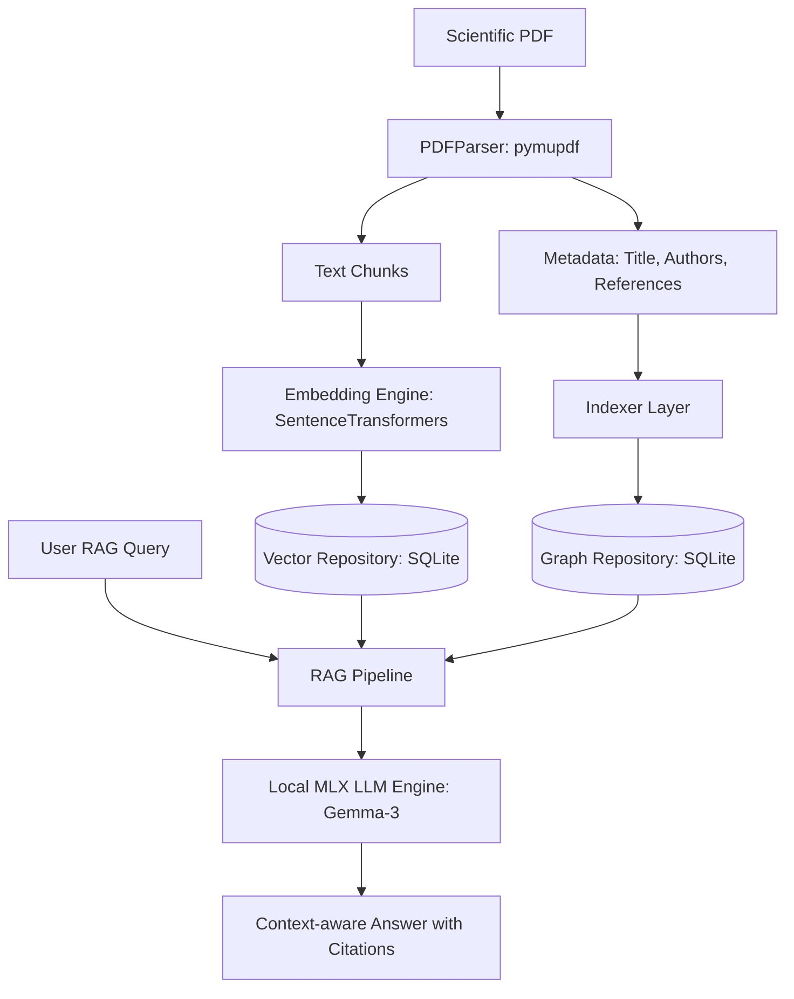

# PDF Graph Analyzer (Local RAG + Graph DB)

Инструмент командной строки (CLI) для систематического анализа научных статей (PDF), который строит гибридный граф знаний (статьи, авторы, концепты, ссылки) и обеспечивает умный локальный поиск ответов (RAG) на базе Apple Silicon (MLX).

Проект работает **полностью локально и оффлайн**, используя встроенную базу данных SQLite и высокооптимизированные MLX-модели для процессоров Apple.

---

## Основные возможности

1. **Экстракция и парсинг научных статей:**
   - Извлечение текста, заголовков, списка авторов, года и DOI с помощью `PyMuPDF`.
   - Heuristic-алгоритмы отсечения баннеров Google Scholar и arXiv.
   - Извлечение библиографического списка (References) для построения графа цитирований.
2. **Гибридное хранилище (SQLite):**
   - **Graph Store:** хранение сущностей (Paper, Author, Concept) и связей (`AUTHORED`, `REFERENCES`, `MENTIONS_CONCEPT`).
   - **Vector Store:** хранение текстовых чанков и векторных эмбеддингов с быстрым in-memory поиском похожих фрагментов через `numpy` (Cosine Similarity).
3. **Локальный RAG с оптимизацией под Apple Silicon:**
   - Интеграция с локальными моделями через `mlx-lm` (например, семейства Gemma-3 или Qwen-3).
   - Ленивая загрузка весов: команды диагностики и визуализации работают мгновенно без инициализации нейросети.
   - Сборка контекста глубиной до 2-х шагов по графу для ответов на сложные междисциплинарные вопросы.
4. **Интерактивная визуализация графа:**
   - Генерация красивого 2D-графа связей на базе `vis.js` в один файл `graph.html` и его автоматический запуск в браузере.

---

## Архитектура системы



---

## Быстрый старт

### 1. Установка зависимостей
Убедитесь, что вы используете подходящую версию Python (рекомендуется Python 3.10+):
```bash
pip install -r requirements.txt
# или
pip install mlx-lm pymupdf sentence-transformers typer pyyaml numpy
```

### 2. Конфигурация (`config.yaml`)
При первом запуске утилита создаст конфигурационный файл по адресу:
`~/.config/pdf-graph-analyzer/config.yaml`

Пример оптимального конфига для macOS (с путями к вашим MLX-моделям):
```yaml
archive_dir: /Users/vladimirkasterin/.local/share/pdf-graph-analyzer/archive
db_path: /Users/vladimirkasterin/.local/share/pdf-graph-analyzer/graph.db
embedding:
  chunk_overlap: 200
  chunk_size: 1000
  model_name: sentence-transformers/all-MiniLM-L6-v2
llm:
  max_tokens: 1000
  model_path: /Users/vladimirkasterin/models/llm/gemma-3-text-12b-it-4bit
  temp: 0.1
```

---

## Использование (CLI)

Все основные команды доступны через интерфейс Typer:

* **Индексация одной статьи:**
  ```bash
  python3 main.py index --file path/to/paper.pdf
  ```
  *При индексации файл парсится, его чанки эмбеддятся, связи заносятся в граф, а сам PDF перемещается в архив (`archive_dir`).*

* **Индексация директории со статьями:**
  ```bash
  python3 main.py index --dir path/to/papers_folder/
  ```

* **Просмотр статистики базы данных:**
  ```bash
  python3 main.py stats
  ```

* **Гибридный оффлайн-запрос (RAG):**
  ```bash
  python3 main.py query "В чем разница между encoder-only и decoder-only моделями?"
  ```

* **Генерация визуализации графа:**
  ```bash
  python3 main.py visualize --output graph.html
  ```

* **Запуск авто-тестов:**
  ```bash
  PYTHONPATH=. pytest tests/
  ```

---

## Реальные сценарии использования (Use Cases)

### Сценарий 1: Быстрое вхождение в новую научную тему
**Проблема:** Вам нужно изучить новую область (например, «Diffusion Models»), у вас есть 15 скачанных PDF-файлов, но нет времени читать их целиком.
**Решение:**
1. Индексируете всю папку:
   ```bash
   python3 main.py index --dir ~/Downloads/diffusion_papers/
   ```
2. Открываете визуализацию графа:
   ```bash
   python3 main.py visualize
   ```
   *Вы сразу увидите ключевые концепты (большие оранжевые узлы), пересекающихся авторов (синие узлы) и то, как статьи ссылаются друг на друга.*
3. Задаете структурированный вопрос:
   ```bash
   python3 main.py query "Какие проблемы с обучением diffusion моделей выделяют авторы?"
   ```
   *RAG соберет релевантные цитаты со всех статей, свяжет их по авторам и выдаст концентрированный ответ с указанием номеров страниц.*

### Сценарий 2: Поиск первоисточников и анализ цитируемости
**Проблема:** Вы пишете обзор литературы (Literature Review) и хотите понять, откуда пошел конкретный термин и какие авторы наиболее авторитетны в выборке.
**Решение:**
1. Выполняете визуализацию:
   ```bash
   python3 main.py visualize
   ```
2. Анализируете граф связей: статьи с наибольшим числом входящих стрелок (`REFERENCES`) являются ключевыми хабами в вашей локальной базе. Синие узлы авторов со множеством связей с разными статьями показывают ключевых исследователей в вашей локальной библиотеке.

### Сценарий 3: Полностью оффлайн-ассистент в путешествиях
**Проблема:** Вы летите в самолете или работаете там, где нет интернета (или данные конфиденциальны), а вам нужно проанализировать патенты или статьи.
**Решение:**
- Поскольку база SQLite, модель эмбеддингов `sentence-transformers` и модель `mlx-lm` (Gemma-3-12b) работают локально на CPU/GPU вашего Mac (через Unified Memory), система функционирует со скоростью до 40+ токенов в секунду без отправки каких-либо данных в облако.

---

## Что можно доделать (Backlog улучшений)

Если вы хотите расширить возможности системы, вот приоритетные направления для доработки:

1. **Улучшение извлечения сущностей через LLM (Semantic Extraction):**
   - Сейчас авторы и концепты извлекаются простыми регулярными выражениями и эвристиками.
   - *Решение:* Добавить проход локальной LLM по тексту абстракта при индексации для качественного выделения ключевых терминов, формул и институтов (NER/Concept Extraction).
2. **Интеграция с внешними API (arXiv, CrossRef, Semantic Scholar):**
   - Парсинг PDF не всегда дает 100% точные метаданные (особенно старых сканов).
   - *Решение:* При наличии DOI отправлять запрос в CrossRef/Semantic Scholar для получения идеальных метаданных, аннотации и полной библиографии.
3. **Продвинутый гибридный поиск (Hybrid Search Weighting):**
   - Настроить балансировку между ключевыми словами (BM25), векторным поиском (Dense Embeddings) и графовым расстоянием.
   - *Решение:* Реализовать ранжирование результатов с использованием Cross-Encoder (Reranker) для повышения качества контекста.
4. **Интерактивный чат (Conversational Memory):**
   - CLI-команда `query` работает в режиме "один вопрос — один ответ".
   - *Решение:* Добавить команду `chat` с сохранением истории переписки (диалоговой памяти) для ведения полноценной сессии обсуждения статей.
5. **Масштабирование векторного поиска (Vector Indexing):**
   - Текущий поиск через `numpy` идеален для 100-300 статей (~30 000 чанков). При переходе к миллионам чанков он замедлится.
   - *Решение:* Подключить `sqlite-vss` или специализированную векторную библиотеку (Faiss/USearch) для быстрого векторного поиска.
