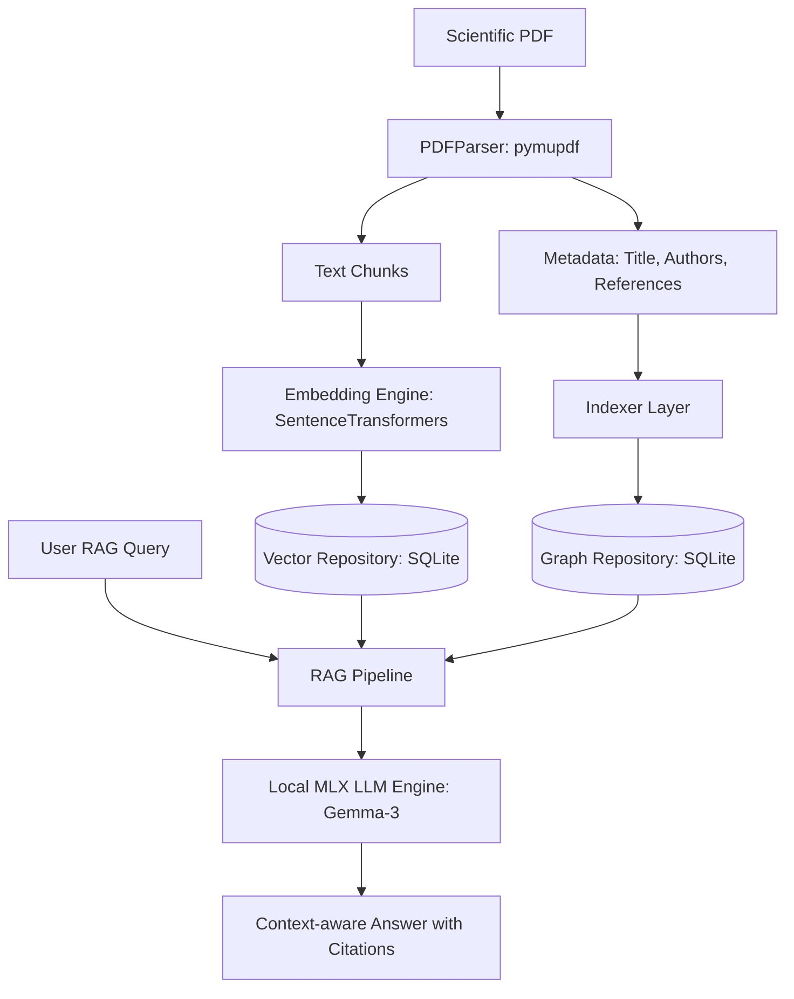

# PDF Graph Analyzer (Local RAG + Graph DB)

Инструмент командной строки (CLI) для систематического анализа научных статей (PDF), который строит гибридный граф знаний (статьи, авторы, концепты, ссылки) и обеспечивает умный локальный поиск ответов (RAG) на базе Apple Silicon (MLX).

Проект работает **полностью локально и оффлайн**, используя встроенную базу данных SQLite и высокооптимизированные MLX-модели для процессоров Apple.

---

## Основные возможности

1. **Экстракция и парсинг научных статей:**
   - Извлечение текста, заголовков, списка авторов, года и DOI с помощью `PyMuPDF`.
   - Heuristic-алгоритмы отсечения баннеров Google Scholar и arXiv.
   - Извлечение библиографического списка (References) для построения графа цитирований.
2. **Семантическое извлечение сущностей (NER/Concept Extraction) через LLM:**
   - При индексации с флагом `--use-llm` локальная модель (Gemma-3/Qwen) автоматически извлекает термины, формулы, концепты и авторов из текста аннотации в структурированном виде (JSON).
3. **Интеграция с Semantic Scholar API:**
   - При обнаружении DOI или названия статьи утилита запрашивает внешнее API Semantic Scholar для автоматического обогащения базы данных идеальными метаданными, абстрактами и реальной сетью внешних цитирований.
4. **Гибридный поиск и Cross-Encoder Reranker:**
   - Совмещение векторного поиска (Dense Embeddings) и ключевых слов (BM25) с использованием формулы Reciprocal Rank Fusion (RRF).
   - Локальный Cross-Encoder (Reranker) на базе `mixedbread-ai/mxbai-rerank-xsmall-v1` для точного переранжирования топ-контекстов перед отправкой в LLM.
5. **Масштабируемый векторный поиск с USearch:**
   - Интеграция быстрого векторного HNSW-индекса `usearch` для мгновенного векторного поиска, совместимого с SQLite.
6. **Интерактивный TUI Чат (Rich TUI):**
   - Удобная командная оболочка для ведения диалога со статьями с сохранением контекстной памяти (Chat Memory), спиннерами загрузки и рендерингом Markdown-ответов прямо в терминале.
7. **Интерактивная визуализация графа:**
   - Генерация красивого 2D-графа связей на базе `vis.js` в один файл `graph.html` и его автоматический запуск в браузере.

---

## Архитектура системы



---

## Быстрый старт

### 1. Установка зависимостей
Убедитесь, что вы используете подходящую версию Python (рекомендуется Python 3.10+):
```bash
pip install -r requirements.txt
# или
pip install mlx-lm pymupdf sentence-transformers typer pyyaml numpy
```

### 2. Конфигурация (`config.yaml`)
При первом запуске утилита создаст конфигурационный файл по адресу:
`~/.config/pdf-graph-analyzer/config.yaml`

Пример оптимального конфига для macOS (с путями к вашим MLX-моделям):
```yaml
archive_dir: /Users/vladimirkasterin/.local/share/pdf-graph-analyzer/archive
db_path: /Users/vladimirkasterin/.local/share/pdf-graph-analyzer/graph.db
embedding:
  chunk_overlap: 200
  chunk_size: 1000
  model_name: sentence-transformers/all-MiniLM-L6-v2
llm:
  max_tokens: 1000
  model_path: /Users/vladimirkasterin/models/llm/gemma-3-text-12b-it-4bit
  temp: 0.1
```

---

## Использование (CLI)

Все основные команды доступны через интерфейс Typer:

* **Индексация одной статьи (без LLM / быстро):**
  ```bash
  python3 main.py index --file path/to/paper.pdf
  ```
  *При индексации файл парсится, его чанки эмбеддятся, связи заносятся в граф, а сам PDF перемещается в архив (`archive_dir`).*

* **Индексация с семантическим извлечением (NER через локальную модель LLM):**
  ```bash
  python3 main.py index --file path/to/paper.pdf --use-llm
  ```
  *Дополнительно запускает локальную модель для извлечения концептов и авторов из аннотации.*

* **Индексация всей директории:**
  ```bash
  python3 main.py index --dir path/to/papers_folder/ --use-llm
  ```

* **Интерактивный TUI Чат (сохраняет контекст диалога):**
  ```bash
  python3 main.py chat
  ```
  *Запускает интерактивную сессию общения в терминале с подсветкой синтаксиса, анимациями и сохранением истории сообщений.*

* **Гибридный оффлайн-запрос (однократный RAG):**
  ```bash
  python3 main.py query "В чем разница между encoder-only и decoder-only моделями?"
  ```

* **Просмотр статистики базы данных:**
  ```bash
  python3 main.py stats
  ```

* **Генерация визуализации графа:**
  ```bash
  python3 main.py visualize --output graph.html
  ```

* **Запуск авто-тестов:**
  ```bash
  PYTHONPATH=. pytest tests/
  ```

---

## Реальные сценарии использования (Use Cases)

### Сценарий 1: Быстрое вхождение в новую научную тему
**Проблема:** Вам нужно изучить новую область (например, «Diffusion Models»), у вас есть 15 скачанных PDF-файлов, но нет времени читать их целиком.
**Решение:**
1. Индексируете всю папку с семантическим разбором через LLM:
   ```bash
   python3 main.py index --dir ~/Downloads/diffusion_papers/ --use-llm
   ```
2. Открываете визуализацию графа:
   ```bash
   python3 main.py visualize
   ```
   *Вы сразу увидите ключевые концепты (большие оранжевые узлы), пересекающихся авторов (синие узлы) и то, как статьи ссылаются друг на друга.*
3. Запускаете интерактивный чат:
   ```bash
   python3 main.py chat
   ```
   *Вы можете задать ряд уточняющих вопросов: «Какие проблемы с обучением diffusion моделей выделяют авторы?» -> «А какие из этих авторов предлагают LoRA для решения?» — и ассистент выдаст структурированный ответ с ссылками на страницы.*

### Сценарий 2: Поиск первоисточников и анализ цитируемости
**Проблема:** Вы пишете обзор литературы (Literature Review) и хотите понять, откуда пошел конкретный термин и какие авторы наиболее авторитетны в выборке.
**Решение:**
1. Выполняете визуализацию:
   ```bash
   python3 main.py visualize
   ```
2. Анализируете граф связей: благодаря обогащению через Semantic Scholar API, в графе автоматически появятся внешние статьи, цитирующие или цитируемые вашими статьями. Вы увидите полноценный граф за рамками вашей локальной библиотеки.

### Сценарий 3: Полностью оффлайн-ассистент в путешествиях
**Проблема:** Вы летите в самолете или работаете там, где нет интернета (или данные конфиденциальны), а вам нужно проанализировать патенты или статьи.
**Решение:**
- Поскольку база SQLite, векторный индекс USearch, модель эмбеддингов `sentence-transformers` и модель `mlx-lm` (Gemma-3-12b) работают локально на CPU/GPU вашего Mac (через Unified Memory), система функционирует полностью автономно.

---

## Что можно доделать (Backlog улучшений)

Если вы хотите расширить возможности системы, вот приоритетные направления для доработки:

1. **Поддержка альтернативных форматов файлов:**
   - Чтение не только PDF, но и EPUB, HTML-документов и файлов разметки Markdown.
2. **Агентный режим автоматических обзоров:**
   - Создание фонового агента, который на основе запроса составляет подробный научный отчет (Synthesis Report) с сопоставлением таблиц, метрик и выводов из десятков статей.
3. **Полнофункциональный Web UI дашборд:**
   - Веб-интерфейс на базе Next.js или Vite + React для администрирования графа, чата с авто-генерацией ментальных карт (mindmaps) в реальном времени.
