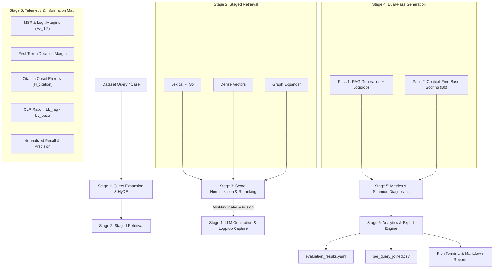

# Integrated RAG Benchmarking & Telemetry Pipeline Architecture

> [!NOTE]
> Comprehensive architectural reference for the Science Graph Retrieval-Augmented Generation (RAG) benchmarking suite. Covers staged retrieval, cross-component score normalization, ID resolution, logit-level telemetry, information-theoretic diagnostics, and data export contracts.

---

## 1. System Overview & Core Objectives

The RAG Benchmarking Pipeline evaluates diverse Retrieval-Augmented Generation baselines (from BM25 lexical baselines to multi-hop Graph-RAG architectures) under quantitative retrieval metrics, information-theoretic diagnostics, logit-level confidence metrics, and non-parametric statistical hypothesis testing.

### Key Technical Capabilities
- **Staged Retrieval & Cross-Modal Fusion**: Non-overlapping retrieval execution across FTS5 keyword matching, dense vector embeddings, and Graph-RAG neighbor expansion.
- **Cross-Component Score Normalization**: MinMaxScaler with single-candidate guardrails to prevent branch score dominance ("Graph-RAG Erasure").
- **Ground-Truth ID Normalization**: Centralized `normalize_id()` resolution enforcing exact document-to-chunk alignment and preventing false Recall score inflation.
- **Logit-Level Telemetry**: Token confidence metrics including Maximum Softmax Probability ($MSP$), top-1 vs top-2 logit margin ($\Delta z_{1,2}$), `first_token_margin`, and citation onset entropy ($H_{\text{citation}}$).
- **Contextual Log-Likelihood Ratio ($CLR$)**: Dual-pass context ablation measuring the net log-likelihood gain contributed by retrieved context relative to a zero-context baseline prompt ($B_0$).
- **Rich Reporting & Artifact Engine**: Automated generation of `evaluation_results.yaml`, `per_query_joined.csv`, Markdown summaries, and interactive Rich terminal output tables.

---

## 2. End-to-End Pipeline Execution Flow



---

## 3. Retrieval & Score Normalization Engine

### 3.1 Ground-Truth ID Normalization ([core/metrics.py](file:///Users/vladimirkasterin/python/graph/back/benchmarks/rag/core/metrics.py))

To prevent Recall inflation caused by mismatches between chunk-level retrieval IDs (e.g. `doc_42_chunk_3`, `docs/paper_101.pdf#chunk_1`) and document-level ground truth (e.g. `doc_42`, `101`), all identifiers are resolved via `normalize_id()`:

```
  Raw Input: "docs/paper_101.pdf#chunk_1"
      │
      ├─ 1. Lowercase: "docs/paper_101.pdf#chunk_1"
      ├─ 2. Strip Path Prefixes: "paper_101.pdf#chunk_1"
      ├─ 3. Strip Extensions & paper_ Prefix: "101#chunk_1"
      ├─ 4. Standardize Separators: "101_chunk_1"
      └─ 5. Truncate Chunk Markers: "101"
```

1. **Lowercasing & Whitespace**: Converts string characters to lowercase and strips outer whitespace.
2. **Path Strip**: Removes standard prefixes (`docs/`, `data/`, `papers/`, `corpus/`, `dataset/`, `./`, `../`).
3. **Extension Strip**: Removes extensions (`.pdf`, `.txt`, `.md`, `.json`, `.html`).
4. **Separator Standardization**: Replaces `-`, `#`, `:`, whitespace, and `/` with standard underscores `_`.
5. **Chunk Truncation**: Strips `_chunk.*` suffixes to map chunk-level IDs back to canonical document entities.

> [!IMPORTANT]
> Failure to normalize IDs prior to metric evaluation causes severe false negative recall penalties. `normalize_id()` guarantees zero-drift comparisons between chunk databases and gold labels.

### 3.2 Cross-Component Score Scaling ([core/retrieval.py](file:///Users/vladimirkasterin/python/graph/back/benchmarks/rag/core/retrieval.py))

Raw scores across heterogeneous retrieval streams differ in scale (BM25: $[0, \infty)$, Vectors: $[-1, 1]$, Graph: structural weights). `normalize_component_scores()` applies Min-Max scaling per candidate batch:

$$S_{\text{norm}} = \frac{S - S_{\min}}{S_{\max} - S_{\min}}$$

- **Zero-Variance / Single-Candidate Guardrail**: When $S_{\max} == S_{\min}$ or a single candidate document is returned, all normalized scores evaluate safely to $1.0$ (or $0.5$ in score-weighted fusion mode), preventing division-by-zero or `NaN` values.

---

## 4. Logit Telemetry & Information-Theoretic Diagnostics

### 4.1 Logit & Softmax Definitions

For logit vector $z$ at token generation position $t$:

$$p_i = \frac{\exp(z_i - \max z)}{\sum_j \exp(z_j - \max z)}$$

- **Maximum Softmax Probability ($MSP$)**:
  $$MSP = \max_i p_i \in (0.0, 1.0]$$
  Quantifies peak model prediction confidence.
- **Logit Margin ($\Delta z_{1,2}$)**:
  $$\Delta z_{1,2} = z_1 - z_2 \ge 0.0$$
  where $z_1 \ge z_2$ are the top-1 and top-2 raw unnormalized logits (or logprobs).
- **First-Token Decision Metrics**: `first_token_margin` ($\Delta z_{1,2}^{(0)}$) and `first_token_msp` ($MSP^{(0)}$) captured at sequence index $t=0$ (the decision point between answering and abstaining).

### 4.2 Citation Onset Entropy ($H_{\text{citation}}$)

Character offsets of citation markers (regex matching `\[|Doc|Source`) are mapped to discrete token sequence indices $t_c$ via `map_char_offset_to_token_idx()`. Shannon entropy is computed at token step $t_c$:

$$H_{\text{citation}} = -\sum_{i=1}^{|V|} p_i(t_c) \log_2 p_i(t_c)$$

### 4.3 Contextual Log-Likelihood Ratio ($CLR$)

Measures the log-likelihood gain contributed by retrieved context:

- **Pass 1 (RAG Context)**: $LL_{\text{rag}} = \sum_{t=1}^N \log P(w_t \mid w_{<t}, \text{Context})$
- **Pass 2 (Zero-Context Baseline $B_0$)**: $LL_{\text{base}} = \sum_{t=1}^N \log P(w_t \mid w_{<t}, \emptyset)$ via `score_text_logprobs_base()`
- **Contextual Log-Likelihood Ratio**:
  $$CLR = LL_{\text{rag}} - LL_{\text{base}}$$

> [!TIP]
> Positive $CLR > 0$ empirically demonstrates that retrieved RAG context increased the generation likelihood of the emitted response sequence.

---

## 5. Primary Codebase Map

| Subsystem | File Path | Primary Functions / Classes |
| :--- | :--- | :--- |
| **ID Normalization & Recall** | [core/metrics.py](file:///Users/vladimirkasterin/python/graph/back/benchmarks/rag/core/metrics.py) | `normalize_id()`, `calculate_retrieval_recall()`, `calculate_context_precision()` |
| **Score Scaling & Fusion** | [core/retrieval.py](file:///Users/vladimirkasterin/python/graph/back/benchmarks/rag/core/retrieval.py) | `normalize_component_scores()`, `run_staged_retrieval()` |
| **Generation & Base Scoring** | [core/generation.py](file:///Users/vladimirkasterin/python/graph/back/benchmarks/rag/core/generation.py) | `_generate_with_logits_safe()`, `score_text_logprobs_base()`, `run_generation()` |
| **Telemetry & Shannon Math** | [core/shannon_estimator.py](file:///Users/vladimirkasterin/python/graph/back/benchmarks/rag/core/shannon_estimator.py) | `compute_softmax()`, `compute_msp()`, `compute_logit_margin()`, `compute_citation_onset_entropy()`, `compute_clr()` |
| **Pydantic Data Models** | [core/models.py](file:///Users/vladimirkasterin/python/graph/back/benchmarks/rag/core/models.py) | `BaselineOutput`, `ShannonDiagnostics`, `ReportOutput` |
| **Analytics & Aggregations** | [core/analytics.py](file:///Users/vladimirkasterin/python/graph/back/benchmarks/rag/core/analytics.py) | `analyze_metrics()`, `build_analytics_dataframe()` |
| **Reporting & Export Engine** | [core/reporting.py](file:///Users/vladimirkasterin/python/graph/back/benchmarks/rag/core/reporting.py) | `save_judge_report()`, `export_wide_csv()`, `export_detailed_csv()` |
| **Metrics Parser & Aggregator**| [parse_metrics.py](file:///Users/vladimirkasterin/python/graph/back/benchmarks/rag/parse_metrics.py) | `MetricsParser`, `_build_joined_data()` |
| **Verification Checkpoints** | [tests/test_verification_checkpoints.py](file:///Users/vladimirkasterin/python/graph/back/benchmarks/rag/tests/test_verification_checkpoints.py) | Verification Checkpoints 1–6 unit suite |

---

## 6. Output Schema Structure

```json
{
  "baseline": "B6",
  "status": "success",
  "retrieval_recall": 0.814,
  "context_precision": 0.691,
  "shannon_diagnostics": {
    "h_rank_pre_rerank": 2.32,
    "h_rank_post_rerank": 0.79,
    "h_lexical_pre_trim": 5.81,
    "h_lexical_post_trim": 5.43,
    "h_graph_relation_type": 1.00,
    "h_graph_degree": 1.91,
    "h_gen": 2.14,
    "h_citation": 1.42,
    "n_citation_tokens": 11,
    "delta_h_gen": 0.45,
    "msp": 0.912,
    "avg_msp": 0.912,
    "logit_margin": 4.85,
    "avg_logit_margin": 4.85,
    "first_token_margin": 6.12,
    "first_token_msp": 0.985,
    "citation_entropy": 1.42,
    "ll_rag": -12.45,
    "ll_base": -48.30,
    "clr": 35.85
  }
}
```

---

## 7. Verification & Quality Assurance

The integrated pipeline is continuously validated by unit and integration tests covering:
- **Probability Normalization**: $\sum p_i = 1.0 \pm 10^{-6}$ across all softmax invocations.
- **Metric Bounds**: $MSP \in (0.0, 1.0]$, Logit Margin $\Delta z_{1,2} \ge 0.0$.
- **ID Normalization Invariance**: `normalize_id("docs/paper_101.pdf#chunk_1") == "101"`.
- **Score Scaling Bounds**: Normalized component scores strictly in $[0.0, 1.0]$.
- **Sequence Alignment**: Token sequence length consistency between Pass 1 ($LL_{\text{rag}}$) and Pass 2 ($LL_{\text{base}}$).

---

## 🔗 Related Documentation
- [Pipeline Orchestration Manual](file:///Users/vladimirkasterin/python/graph/back/benchmarks/rag/docs/architecture/pipeline_orchestration.md)
- [Logit Telemetry Specifications](file:///Users/vladimirkasterin/python/graph/back/benchmarks/rag/docs/telemetry/logit_telemetry.md)
- [Shannon Estimator Manual](file:///Users/vladimirkasterin/python/graph/back/benchmarks/rag/docs/telemetry/shannon_estimator.md)
- [Non-Parametric Statistical Testing Framework](file:///Users/vladimirkasterin/python/graph/back/benchmarks/rag/docs/statistics/statistical_testing_framework.md)
